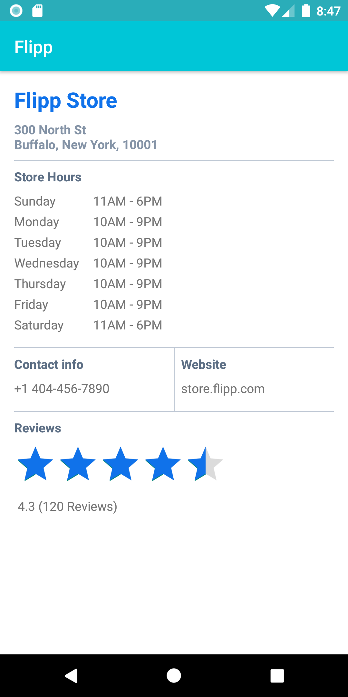

summary: Working with MVVM, Livedata and Databinding
id: android_working_with_mvvm_livedata_databinding
categories: Android
tags: medium
status: Published 
authors: Sai Emani
Feedback Link: https://github.com/SaiEmaniFlipp

# Working with MVVM, LiveData and Databinding

<!-- ------------------------ -->
## Welcome 
Duration: 5

This practical codelab is part of the Flipp Android Engineer Onboarding course. Other codelabs that are part of the course are as follows:
- Working with Coroutines, Retrofit and Moshi
- Working with Room

### Introduction
The Android operating system provides a strong foundation for building apps that rull well on a wide range of devices and form factors. However, issues like complex lifecycles and a lack of a recommended app architecture make it challenging to write robust apps. The Android Architecture Components provide libraries for common tasks such as lifecycle management and data persistence to make it easier to implement the recommended architecture.

### What are the Architecture components?
Before we get into the nitty-gritty of how we work with the various components at Flipp, let us walk through a short overview of the [Architecture Components](https://developer.android.com/topic/libraries/architecture/index.html) and how they work together. 

The diagram below shows a basic form of the recommended architecture for apps that use Architecture Components. The architecture consists of a UI controller, a ViewModel that serves LiveData, a Repository, and a Room database. The Room database is backed by an SQLite database and accessible through a data access object (DAO).


### Architecture Components @ Flipp
We here at Flipp, have embraced this recommendation from Google on how to build a robust, testable and maintainable application using Architecture components. 

All our `activities` and `fragments` represent the view layer. We have `viewmodels` that provide the necessary data to the UI and act as communication centers between the `repository` and the UI. We use the repository as a class that helps us manage multiple data sources, which in our case are the Room database and a remote data source like our Flipp backend (Maestro, BackFlipp, Accounts, etc).

We make use of Room, which is a database layer on top of SQLite that takes care of mundane taks that were previously part of a verbose helper class.

### What you should already know
All the Android codelabs will be working with Kotlin, so familiarity with the language is recommended. 

It helps to be familiar with:

- Software architectural patterns that separate data from the UI.
- The [observer pattern](https://en.wikipedia.org/wiki/Observer_pattern). In summary, the observer pattern defines a one-to-many dependency between objects. Whenever an object changes its state, all the object's dependents are notified and updated automatically. The main object is called the "subject" and its dependents are called the "observers." Usually, the subject notifies the observers by calling one of the observers' methods. The subject knows what methods to call, because the observers are "registered" with the subject and specify the methods to call.

### What you'll learn
How to work with the MVVM pattern, architecture components, databinding in the context of the Flipp application. You'll use [ViewModel](https://developer.android.com/topic/libraries/architecture/viewmodel.html), [LiveData](https://developer.android.com/reference/android/arch/lifecycle/LiveData.html), [Databinding](https://developer.android.com/topic/libraries/data-binding).

### What you'll do
- Add a new feature to the Flipp app. The new feature is as follows: When an user is on a storefront (flyer page), they can know get more information about the store, by clicking on the new `info` button on the toolbar.
- The info button will launch the new `Activity` that we will build as part of this code lab.
- Use a `ViewModel` to separate all data operations from the UI.
- Use `DataBinding` to bind UI components in XML to data sources using a declarative format rather than programmatically, reducing boilerplate code.


<!-- ------------------------ -->
## Feature overview
Duration: 2

In this practical you build a feature that uses the Android Architecture Components. The `Store Info` feature displays information like address, store hours, contact information, ratings, etc.
This feature is basic, but sufficiently complete that we can use it as a template to build on.

The StoreInfo feature does the following:
- The `StoreInfoActivity` works with `StoreInfoActivityViewModel` to fetch and display store information to the user.
- The `StoreInfoActivityViewModel` fetches the required information from a web service using the `Retrofit` network library in an upcoming code lab.
- The fetched data will also be persisted for offline availability using a `Room` database in an upcoming lab.

The screenshot below shows the `Store Info` feature.<br/>


### StoreInfo feature architecture overview
This feature will be built using the architecture that was discussed in the first section of this codelab.


<!-- ------------------------ -->
## Starter Code
Duration: 5

To help you get started with developing the `Store Info` feature, we are providing you with started code where a lot of the boiler plate work has been done. 
Checkout this [branch](https://github.com/wishabi/flipp-droid/tree/codelab/android-mvvm/starter-code) to get started with the codelab.
Let us take some time to review the given starter code.

### StoreInfoActivity
A basic activity to display store information has been added to which you will be adding the required code in this codelab. 
Here is a snippet of what that activity looks like:
```kotlin
class StoreInfoActivity : AppCompatActivity() {

    override fun onCreate(savedInstanceState: Bundle?) {
        super.onCreate(savedInstanceState)
        setContentView(R.layout.activity_store_info)
    }
}
```

### Changes to AndroidManifest
`StoreInfoActivity` has been added to the `AndroidManifest`'s `application` tag to register it with our Flipp Application.
```xml
<activity android:name=".app.storeinfo.StoreInfoActivity"
      android:screenOrientation="sensorPortrait" />
```

### activity_store_info.xml
The required xml layout to render all the required information has been created for you. `ConstraintLayout` have been used to create this complex view. 

### strings.xml
All the required string resources have been added to the `strings.xml` file for your convenience. 
```xml
<!-- CodeLab Strings -->
  <string name="code_lab_store_hours">Store Hours</string>
  <string name="code_lab_store_hours_sunday">Sunday</string>
  <string name="code_lab_store_hours_monday">Monday</string>
  <string name="code_lab_store_hours_tuesday">Tuesday</string>
  <string name="code_lab_store_hours_wednesday">Wednesday</string>
  <string name="code_lab_store_hours_thursday">Thursday</string>
  <string name="code_lab_store_hours_friday">Friday</string>
  <string name="code_lab_store_hours_saturday">Saturday</string>
  <string name="code_lab_contact_info">Contact info</string>
  <string name="code_lab_website">Website</string>
  <string name="code_lab_reviews">Reviews</string>
  <string name="code_lab_review_text">%1$f (%2$d Reviews)</string>
  <string name="code_lab_store_info">View Store Info</string>
```

### storefront_menu.xml
The entry point to this feature is from a menu option called `View Store Info` in the `StorefrontCarouselActivity`. This menu option has been added to the `storefront_menu` file.
```xml
 <item
    android:id="@+id/code_lab_store_info"
    android:title="@string/code_lab_store_info"
    app:showAsAction="never" />
```

### StorefrontCarouselActivity
The code to start the `StoreInfoActivity` on click of the above defined menu option has been added for you in the `StorefrontCarouselActivity`. 
The `onOptionsItemSelected()` has been modified to account for the newly added menu option.
Here is the code snippet that was added:
```java
case R.id.code_lab_store_info:
        startActivity(new Intent(this, StoreInfoActivity.class));
        return true;
```

### StoreInfo
A `data` class to store the necessary information that will be displayed has been created with the required data fields.
We will build on this class to make it compatible with Retrofit and Room in the upcoming code labs.
```kotlin
data class StoreInfo(val storeName: String,
                     val storeAddress: String,
                     val storeHours: List<String>,
                     val storeContactNumber: String,
                     val storeWebsite: String,
                     val storeRating: Float,
                     val storeNumReviews: Int)
```

### What's next
We will start to build this feature from our next step. First up, creating the `Repository`.

<!-- ------------------------ -->
## Task 1: Create the Repository
Duration: 5


A `Repository` is a class that abstracts access to multiple data sources. The Repository is not part of the Architecture Components libraries, but is a suggested best practice and we at Flipp have embraced this pattern. It helps us provide a clean API to the rest of the app for app data. Additionally, it helps us unit test viewmodels effectively by providing the option to mock out the repository layer which in turn lets us mock the data sources.


### Step 1
Create a class called `StoreInfoRepository` that extends `InjectableHelper` in the package `com.wishabi.flipp.app.storeinfo`. By extending `InjectableHelper` we make this class available to the `ServiceManager` which is an in-house built `ServiceLocator`.
```kotlin
class StoreInfoRepository : InjectableHelper() {}
```

### Step 2
Add a member function called `fetchStoreInfo()` that accepts the arguments `postalCode` and `storeName`. Mark this function as a `suspend` function to make it available to coroutines. Let us look at what Coroutines are and how we use them at Flipp in an upcoming codelab, however, here is a quick blurb on what `suspend` means.

The keyword suspend is Kotlin's way of marking a function, or function type, available to coroutines. When a coroutine calls a function marked suspend, instead of blocking until that function returns like a normal function call, it suspends execution until the result is ready then it resumes where it left off with the result. While it's suspended waiting for a result, it unblocks the thread that it's running on so other functions or coroutines can run.


Let the `fetchStoreInfo()` function return an instance of `StoreInfo` that we will use in our `StoreInfoActivity` to display the required information to the user. <br/>
```kotlin
suspend fun fetchStoreInfo(postalCode: String, storeName: String): StoreInfo {
        
}
```

### Step 3
For the purpose of this codelab, return a static `StoreInfo` object from the repository. We will look at how to connect our repository to a network service and a database in upcoming codelabs. Add a 3 second delay before you return `StoreInfo` to mock a real network or database operation. 
```kotlin
    suspend fun fetchStoreInfo(postalCode: String, storeName: String): StoreInfo {
        delay(3_000)
        return StoreInfo(storeName = "Flipp Store",
                storeAddress = "3250 Bloor St W Unit 300, Etobicoke, ON M8X 2X9",
                storeHours = getStoreHours(),
                storeContactNumber = "+1 416-626-7092",
                storeWebsite = "store.flipp.com",
                storeNumReviews = 61,
                storeRating = 4.5f)
    }
```

### Step 4
Add a private method `getStoreHours()`, that will return a list of static store hours. <br/>
```kotlin
    private fun getStoreHours(): List<String> {
        return mutableListOf("11AM - 6PM", "10AM - 8PM", "10AM - 8PM", "10AM - 8PM", "10AM - 8PM", "10AM - 8PM", "10AM - 9PM")
    }
```

Here is the complete code for the `StoreInfoRepository` class:
```kotlin
class StoreInfoRepository : InjectableHelper() {
    suspend fun fetchStoreInfo(postalCode: String, storeName: String): StoreInfo {
        delay(3_000)
        return StoreInfo(storeName = "Flipp Store",
                storeAddress = "3250 Bloor St W Unit 300, Etobicoke, ON M8X 2X9",
                storeHours = getStoreHours(),
                storeContactNumber = "+1 416-626-7092",
                storeWebsite = "store.flipp.com",
                storeNumReviews = 61,
                storeRating = 4.5f)
    }

    private fun getStoreHours(): List<String> {
        return mutableListOf("11AM - 6PM", "10AM - 8PM", "10AM - 8PM", "10AM - 8PM", "10AM - 8PM", "10AM - 8PM", "10AM - 9PM")
    }
}
```
<!-- ------------------------ -->
## Task 2: Create the View state wrapper
Duration: 2

We at Flipp, have been working with the MVVM pattern for a while now and have began to notice several common patterns in each screen:
- show initial loading indicator
- handle failure with an error screen or toast
- provide a meaningful empty state in absence of data
- display the final, loaded data
It became apparent and necessary to implement a standard mechanism with whcih to model and display these states.

### Our Solution

Modeling UI States with Sealed Classes

Sealed classes are used for representing restricted class hierarchies. As such, sealed classes are useful when modeling states within various app workflows. We've leveraged this to simplify the interaction between the activity and the viewmodel.

### Step 1
Create a sealed class called `StoreInfoViewState` in the same package as the `StoreInfoRepository`, `com.wishabi.flipp.app.storeinfo`<br/>
```kotlin
sealed class StoreInfoViewState<out T>
```

### Step 2
Create the following class hierarchy to represent different view states like `Success`, `Loading` and `Error`<br/>

```kotlin
data class Success<out T>(val value: T): StoreInfoViewState<T>()
data class Error(val errorMsg: String): StoreInfoViewState<Nothing>()
object Loading: StoreInfoViewState<Nothing>()
```
For view states that do not require to hold any data, like in the case of `Loading`, we can mark them as an `object` instead of as a `class`.

Here is the complete code for the `StoreInfoViewState` class.<br/>
```kotlin
sealed class StoreInfoViewState<out T>

data class Success<out T>(val value: T): StoreInfoViewState<T>()
data class Error(val errorMsg: String): StoreInfoViewState<Nothing>()
object Loading: StoreInfoViewState<Nothing>()
```
<!-- ------------------------ -->
## Task 3: Create the ViewModel
Duration: 10


The `ViewModel` is a class whose role is to provide data to the UI and survive configuration changes. A viewmodel acts as a communication center between the repository (data layer) and the UI. At Flipp, we use the `ViewModel` to separate out the app's UI data from our Activities and Fragments to better follow the single responsibility principle, where 
we want our activities and fragments to be only responsible for drawing data to the screen, while our `ViewModel` is responsible for holding and processing all the data needed for the UI.

In the `ViewModel`, we use `LiveData` for changeable data that the UI will use or display.

### Step 1
Create a class called `StoreInfoViewModel` that extends `ViewModel` in the package `package com.wishabi.flipp.app.storeinfo`.<br/>
```kotlin
class StoreInfoActivityViewModel : ViewModel() {}
```

### Step 2
Modify the constructor to accept `StoreInfoRepository` as an argument.<br/>
```kotlin
class StoreInfoActivityViewModel(private val repository: StoreInfoRepository) : ViewModel() {}
```

### Step 3
Add a private `MutableLiveData` member variable to hold the fetched `StoreInfo` object, which is wrapped in the above created `StoreInforViewState` UI state sealed class.<br/>
   
```kotlin
private var _storeInfo: MutableLiveData<StoreInfoViewState<StoreInfo>> = MutableLiveData()
```

### Step 4
Add a public `LiveData` member variable that exposes the above `MutableLiveData` object, `_storeInfo` to our activity `StoreInfoActivity`.<br/>
```kotlin
val storeInfo: LiveData<StoreInfoViewState<StoreInfo>>
        get() = _storeInfo
```
We follow the above practice of not exposing the `MutableLiveData` to the activity to prevent the view layer (Activity) from modifying data.

### Step 5
Add two private `String?` member variables to to store `postalCode` and `storeName`.<br/>
```kotlin
private var postalCode: String? = null
private var storeName: String? = null
```

### Step 6
Create a public `fetchStoreInfo()` method that accepts two arguments: `postalCode: String` and `storeName: String`.
```kotlin
    fun fetchPostalCode(postalCode: String?, storeName: String?) {
        
    }
```

### Step 7
Modify the above created `fetchStoreInfo()` method to call the `StoreInfoRepository`'s `fetchStoreInfo()` method to fetch the required `StoreInfo`.<br/>
```kotlin
fun fetchStoreInfo(postalCode: String?, storeName: String?) {
  this.postalCode = postalCode
  this.storeName = storeName
        
  repository.fetchStoreInfo(postalCode, storeName)
}
```
Once you add the above code, you will notice that the IDE throws a compile time exception, indicating that a `suspend` function should only be called from a `coroutine` or another suspend function. To limit the scope of this codelab, copy paste the following piece of code that creates a `coroutine` and updates the `MutableLiveData` in our viewmodel.<br/>

```kotlin
fun fetchStoreInfo(postalCode: String?, storeName: String?) {
        this.postalCode = postalCode
        this.storeName = storeName

        viewModelScope.launch { 
            try {
                val storeInfo = repository.fetchStoreInfo(postalCode, storeName)
                _storeInfo.postValue(Success(storeInfo))
            } catch (e: Exception) {
                _storeInfo.postValue(Error("There was an error fetching store information"))
            }
        }
    }
```
The above code will make more sense when you complete the upcoming code lab on how to work with `Coroutines`. 

### Step 8
To prevent duplicate calls being made to the repository, add a check to see if the activity is requesting information for the same postal code and store name. Additionally, check whether the current value of the `_storeInfo` live data is of type `Success`.<br/>
```kotlin
fun fetchStoreInfo(postalCode: String?, storeName: String?) {
        if (postalCode.isNullOrEmpty() || storeName.isNullOrEmpty()) {
            _storeInfo.postValue(Error("Invalid postal code or store name"))
            return
        }

        if (_storeInfo.value is Success 
                && this.postalCode.equals(postalCode, ignoreCase = true) 
                && this.storeName.equals(storeName, ignoreCase = 
                true)) {
            return
        }
        
        this.postalCode = postalCode
        this.storeName = storeName

        viewModelScope.launch {
            try {
                val storeInfo = repository.fetchStoreInfo(postalCode, storeName)
                _storeInfo.postValue(Success(storeInfo))
            } catch (e: Exception) {
                _storeInfo.postValue(Error("There was an error fetching store information"))
            }
        }
    }
```

### Step 9
To indicate to the activity that the request is in progress, we can make use of the `Loading` UI state. Modify the above method to first set the value of `_storeInfo` to a `Loading` object.<br/>
```kotlin
fun fetchStoreInfo(postalCode: String, storeName: String) {
        if (postalCode.isNullOrEmpty() || storeName.isNullOrEmpty()) {
            _storeInfo.postValue(Error("Invalid postal code or store name"))
            return
        }

        if (_storeInfo.value is Success
                && this.postalCode.equals(postalCode, ignoreCase = true)
                && this.storeName.equals(storeName, ignoreCase =
                true)) {
            return
        }

        _storeInfo.postValue(Loading)
        
        this.postalCode = postalCode
        this.storeName = storeName

        viewModelScope.launch {
            try {
                val storeInfo = repository.fetchStoreInfo(postalCode, storeName)
                _storeInfo.postValue(Success(storeInfo))
            } catch (e: Exception) {
                _storeInfo.postValue(Error("There was an error fetching store information"))
            }
        }
    }
```

Here is the complete code for the `StoreInfoViewModel` class.
```kotlin
class StoreInfoActivityViewModel(private val repository: StoreInfoRepository) : ViewModel() {
    private var _storeInfo: MutableLiveData<StoreInfoViewState<StoreInfo>> = MutableLiveData()

    val storeInfo: LiveData<StoreInfoViewState<StoreInfo>>
        get() = _storeInfo

    private var postalCode: String? = null
    private var storeName: String? = null

    fun fetchStoreInfo(postalCode: String, storeName: String) {
        if (postalCode.isNullOrEmpty() || storeName.isNullOrEmpty()) {
            _storeInfo.postValue(Error("Invalid postal code or store name"))
            return
        }

        if (_storeInfo.value is Success
                && this.postalCode.equals(postalCode, ignoreCase = true)
                && this.storeName.equals(storeName, ignoreCase =
                true)) {
            return
        }

        _storeInfo.postValue(Loading)

        this.postalCode = postalCode
        this.storeName = storeName

        viewModelScope.launch {
            try {
                val storeInfo = repository.fetchStoreInfo(postalCode, storeName)
                _storeInfo.postValue(Success(storeInfo))
            } catch (e: Exception) {
                _storeInfo.postValue(Error("There was an error fetching store information"))
            }
        }
    }
}
```
<!-- ------------------------ -->
## Task 4: Implement the ViewModelFactory
Duration: 2
As your `ViewModel` depends on the `StoreInfoRepository` you need create a `ViewModelFactory` that will help creating the `ViewModel` when you request for it from the `Activity`.

### Step 1
Create a new class `StoreInfoViewModelFactory` that extends `ViewModelProvider.NewinstanceFactory` in the package `com.wishabi.flipp.app.storeinfo`.
```kotlin
class StoreInfoViewModelFactory() : ViewModelProvider.NewInstanceFactory() {}
```

### Step 2
Override the `create()` method that is provided by the `NewInstanceFactory` and add the following code in.
```kotlin
override fun <T : ViewModel?> create(modelClass: Class<T>): T {
    val storeInfoRepository = ServiceManager.getService(StoreInfoRepository::class.java)

    return when (modelClass) {
        StoreInfoActivityViewModel::class.java -> {
            StoreInfoActivityViewModel(storeInfoRepository) as T
        }
        else -> throw IllegalArgumentException("View Model not found")
    }
}
```
The above code creates an instance of the `StoreInfoRepository` and injects it into the instance of the `StoreInfoActivityViewModel` that we create.

<!-- ------------------------ -->
## Task 5: Connect the UI with the data
Duration: 5

Now that you have created the all the necessary components to fetch the data, let us now connect these parts to the `StoreInfoActivity` to display the data. 
To display the data from the repository, you add an observer that observes the `LiveData` in the `StoreInfoActivityViewModel`. Whenever the data changes, the `onChanged()` callback of the `LiveData` is invoked.

### Step 1
In `StoreInfoActivity`, create a member variable for the `ViewModel`, because all the activity's interactions are with the `StoreInfoActivityViewModel` only.
```kotlin
private val storeInfoActivityViewModel: StoreInfoActivityViewModel by lazy {
    ViewModelProvider(this, StoreInfoViewModelFactory()).get(StoreInfoActivityViewModel::class.java)
}
```

### Step 2
In the `onCreate()`, add an observer for the `LiveData` `storeInfo` present in the `StoreInfoActivityViewModel`. When the observed data changes while the activity is in the foreground, the `onChanged()` method is invoked and you can set the updated data to the UI widgets.

```kotlin
storeInfoActivityViewModel.storeInfo.observe(this, Observer { storeInfoViewState ->
  storeInfoViewState?.let {
      when(it) {
          is Success -> updateUI(it)
          is Error -> showError(it)
          is Loading -> showLoading()
      }
    }
})
```

### Step 3
Add a private function `updateUI()` in the `StoreInfoActivity`, that accepts an instance of `Success<StoreInfo>` view state and sets the required values to the UI widgets based on the data that we receive from the `ViewModel`.
```kotlin
private fun updateUI(data: Success<StoreInfo>) {
    store_info_progress_bar.visibility = View.GONE
    val storeInfo = data.value
    
    store_name_text_view.text = storeInfo.storeName
    store_address_text_view.text = storeInfo.storeAddress
    
    store_hours_sunday_text_view.text = storeInfo.storeHours[0]
    store_hours_monday_text_view.text = storeInfo.storeHours[1]
    store_hours_tuesday_text_view.text = storeInfo.storeHours[2]
    store_hours_wednesday_text_view.text = storeInfo.storeHours[3]
    store_hours_thursday_text_view.text = storeInfo.storeHours[4]
    store_hours_friday_text_view.text = storeInfo.storeHours[5]
    store_hours_saturday_text_view.text = storeInfo.storeHours[6]
    
    store_contact_info_text_view.text = storeInfo.storeContactNumber
    store_website_text_view.text = storeInfo.storeWebsite
    
    store_rating_bar.rating = storeInfo.storeRating
    store_rating_text_view.text = getString(R.string.code_lab_review_text, storeInfo.storeRating, storeInfo.storeNumReviews)
}
```

### Step 4
Add a private function `showError()` in the `StoreInfoActivity`, that accepts an instance of `Error` view state and displays a toast message to the user.
```kotlin
private fun showError(error: Error) {
    store_info_progress_bar.visibility = View.GONE
    Toast.makeText(this, error.errorMsg, Toast.LENGTH_LONG).show()
}
```

### Step 5
Add a private function `showLoading()` in the `StoreInfoActivity`, that sets the visibility of the `ProgressBar` with id `store_info_progress_bar` to `View.VISIBLE`.
```kotlin
private fun showLoading() {
    store_info_progress_bar.visibility = View.VISIBLE
}
```

### Step 6
Make sure to set the visibility of the above mentioned `ProgressBar` to `View.GONE` in both the `updateUI()` and `showError()` methods.

### Step 7
The final step is to call the `fetchStoreInfo()` method in the `ViewModel`. You can use the `storeName` and `postalCode` that you receive as part of the `Intent` bundle that was used to start this `Activity`. Add the following code to the `onCreate()` method to read `postalCode` and `storeName` from the intent bundle. You can use the declared constants `PARAM_POSTAL_CODE` and `PARAM_STORE_NAME` as keys when requesting the values from the intent. Finally, call the method in the viewmodel to fetch the data. 
Your `onCreate()` method should look something like this after making all these changes.
```kotlin
override fun onCreate(savedInstanceState: Bundle?) {
    super.onCreate(savedInstanceState)
    setContentView(R.layout.activity_store_info)

    val storeName = intent.getStringExtra(PARAM_STORE_NAME)
    val postalCode = intent.getStringExtra(PARAM_POSTAL_CODE)

    storeInfoActivityViewModel.storeInfo.observe(this, Observer { storeInfoViewState ->
        storeInfoViewState?.let {
            when(it) {
                is Success -> updateUI(it)
                is Error -> showError(it)
                is Loading -> showLoading()
            }
        }
    })

    storeInfoActivityViewModel.fetchStoreInfo(postalCode, storeName)
}
```


Here is the complete code for the `StoreInfoActivity` class.
```kotlin
class StoreInfoActivity : AppCompatActivity() {

  companion object {
      public const val PARAM_STORE_NAME = "param_store_name"
      public const val PARAM_POSTAL_CODE = "postal_code"
  }

  private val storeInfoActivityViewModel: StoreInfoActivityViewModel by lazy {
        ViewModelProvider(this, StoreInfoViewModelFactory()).get(StoreInfoActivityViewModel::class.java)
    }

  override fun onCreate(savedInstanceState: Bundle?) {
      super.onCreate(savedInstanceState)
      setContentView(R.layout.activity_store_info)

      val storeName = intent.getStringExtra(PARAM_STORE_NAME)
      val postalCode = intent.getStringExtra(PARAM_POSTAL_CODE)

      storeInfoActivityViewModel.storeInfo.observe(this, Observer { storeInfoViewState ->
          storeInfoViewState?.let {
              when(it) {
                  is Success -> updateUI(it)
                  is Error -> showError(it)
                  is Loading -> showLoading()
              }
          }
      })

      storeInfoActivityViewModel.fetchStoreInfo(postalCode, storeName)
  }

  private fun showLoading() {
      store_info_progress_bar.visibility = View.VISIBLE
  }

  private fun showError(error: Error) {
      store_info_progress_bar.visibility = View.GONE
      Toast.makeText(this, error.errorMsg, Toast.LENGTH_LONG).show()
  }

  private fun updateUI(data: Success<StoreInfo>) {
      store_info_progress_bar.visibility = View.GONE
      val storeInfo = data.value

      store_name_text_view.text = storeInfo.storeName
      store_address_text_view.text = storeInfo.storeAddress

      store_hours_sunday_text_view.text = storeInfo.storeHours[0]
      store_hours_monday_text_view.text = storeInfo.storeHours[1]
      store_hours_tuesday_text_view.text = storeInfo.storeHours[2]
      store_hours_wednesday_text_view.text = storeInfo.storeHours[3]
      store_hours_thursday_text_view.text = storeInfo.storeHours[4]
      store_hours_friday_text_view.text = storeInfo.storeHours[5]
      store_hours_saturday_text_view.text = storeInfo.storeHours[6]

      store_contact_info_text_view.text = storeInfo.storeContactNumber
      store_website_text_view.text = storeInfo.storeWebsite

      store_rating_bar.rating = storeInfo.storeRating
      store_rating_text_view.text = getString(R.string.code_lab_review_text, storeInfo.storeRating, storeInfo.storeNumReviews)
  }
}
```
<!-- ------------------------ -->
## Task 6: Databinding
Duration: 2

Now that you have all the components working together, let us look at how `Databinding` can help to clean up your UI code.

### Step 1
Data Binding has already been enabled on the Flipp Project. Let us convert our view `activity_store_info.xml` to support data binding. 
Open `activity_store_info.xml`. It is a regular layout with a ConstraintLayout as the root element.

In order to convert the layout to Data Binding, you need to wrap the root element in a <layout> tag. You'll also have to move the namespace definitions (the attributes that start with xmlns:) to the new root element.

Android Studio offers a handy way to do this automatically: Right-click the root element, select Show Context Actions, then Convert to data binding layout:


Your layout should now look like this:
```xml
<?xml version="1.0" encoding="utf-8"?>
<!-- Copyright (c) 2020 Wishabi. All rights reserved. -->

<layout xmlns:android="http://schemas.android.com/apk/res/android"
    xmlns:app="http://schemas.android.com/apk/res-auto"
    xmlns:tools="http://schemas.android.com/tools">

    <data>

    </data>

    <androidx.constraintlayout.widget.ConstraintLayout
        android:layout_width="match_parent"
        android:layout_height="match_parent"
        android:background="@android:color/white">

        <androidx.constraintlayout.widget.Guideline
            android:id="@+id/start_guideline"
            android:layout_width="wrap_content"
            android:layout_height="wrap_content"
            android:orientation="vertical"
            app:layout_constraintGuide_begin="@dimen/dimen_16dp" />
```

The `<data>` tag will contain layout variables.

Layout variables are used to write layout expressions. Layout expressions are placed in the value of element attributes and they use the `@{expression}` format. Here are some examples:
```xml
android:text="@{String.valueOf(index + 1)}"
android:visibility="@{age < 13 ? View.GONE : View.VISIBLE}"
android:transitionName='@{"image_" + id}'
```

Some of the advantages that we noticed by using layout expressions to bind components in the layout file are:
- Help prevent memory leaks and null pointer exceptions
- Streamline our activity's code by removing UI framework calls

Now, let's modify your `StoreInfoActivityViewModel` to work with databinding.

<!-- ------------------------ -->
## Task 7 Modify ViewModel to support data binding
Duration: 5

### Step 1
Open `StoreInfoActivityViewModel` and add the following `LiveData` fields to allow binding to the different UI elements.
```kotlin
var storeNameLiveData = MutableLiveData("")
var storeAddressLiveData = MutableLiveData("")
var sundayStoreHoursLiveData = MutableLiveData("")
var mondayStoreHoursLiveData = MutableLiveData("")
var tuesdayStoreHoursLiveData = MutableLiveData("")
var wednesdayStoreHoursLiveData = MutableLiveData("")
var thursdayStoreHoursLiveData = MutableLiveData("")
var fridayStoreHoursLiveData = MutableLiveData("")
var saturdayStoreHoursLiveData = MutableLiveData("")
var storeContactNumberLiveData = MutableLiveData("")
var storeWebsiteLiveData = MutableLiveData("")
var storeRatingLiveData = MutableLiveData(0f)
var storeNumReviewsLiveData = MutableLiveData(0)
var loadingLiveData = MutableLiveData(true)
```

### Step 2
Modify the `fetchStoreInfo()` method to update the above declared `LiveData` variables.
```kotlin
fun fetchStoreInfo(postalCode: String?, storeName: String?) {
    if (postalCode.isNullOrEmpty() || storeName.isNullOrEmpty()) {
        _storeInfo.postValue(Error("Invalid postal code or store name"))
        return
    }

    if (_storeInfo.value is Success
            && this.postalCode.equals(postalCode, ignoreCase = true)
            && this.storeName.equals(storeName, ignoreCase =
            true)) {
        return
    }

    loadingLiveData.postValue(true)

    this.postalCode = postalCode
    this.storeName = storeName

    viewModelScope.launch {
        try {
            val storeInfo = repository.fetchStoreInfo(postalCode, storeName)

            storeNameLiveData.postValue(storeInfo.storeName)
            storeAddressLiveData.postValue(storeInfo.storeAddress)
            sundayStoreHoursLiveData.postValue(storeInfo.storeHours[0])
            mondayStoreHoursLiveData.postValue(storeInfo.storeHours[1])
            tuesdayStoreHoursLiveData.postValue(storeInfo.storeHours[2])
            wednesdayStoreHoursLiveData.postValue(storeInfo.storeHours[3])
            thursdayStoreHoursLiveData.postValue(storeInfo.storeHours[4])
            fridayStoreHoursLiveData.postValue(storeInfo.storeHours[5])
            saturdayStoreHoursLiveData.postValue(storeInfo.storeHours[6])
            storeWebsiteLiveData.postValue(storeInfo.storeWebsite)
            storeContactNumberLiveData.postValue(storeInfo.storeContactNumber)
            storeRatingLiveData.postValue(storeInfo.storeRating)
            storeNumReviewsLiveData.postValue(storeInfo.storeNumReviews)

            loadingLiveData.postValue(false)
        } catch (e: Exception) {
            _storeInfo.postValue(Error("There was an error fetching store information"))
            loadingLiveData.postValue(false)
        }
    }
}
```

<!-- ------------------------ -->
## Task 8: Using layout expressions
Duration: 10

Let's start with binding our `ViewModel`.

### Step 1
Create a variable to hold our `StoreInfoActivityViewModel` inside the `<data>` tag.
```xml
<data>
    <variable name="storeInfoActivityViewModel" 
        type="com.wishabi.flipp.app.storeinfo.StoreInfoActivityViewModel" />
</data>
```

### Step 2
Look for the TextView with ID `store_name_text_view` and add the `android:text` attribute with a layout expression:
```xml
<TextView
  android:id="@+id/store_name_text_view"
  style="@style/Flipp.Typography.Title"
  android:layout_width="wrap_content"
  android:layout_height="wrap_content"
  android:text="@{storeInfoActivityViewModel.storeNameLiveData}"
  android:textColor="@color/primary3"
  app:layout_constraintStart_toStartOf="@+id/start_guideline"
  app:layout_constraintTop_toTopOf="@+id/top_guideline"
  tools:text="Flipp Store" />
```

### Step 3
Look for the TextView with ID `store_address_text_view` and add the `android:text` attribute with a layout expression:
```xml
<TextView
  android:id="@+id/store_address_text_view"
  style="@style/Flipp.Typography.SubHeader"
  android:layout_width="wrap_content"
  android:layout_height="wrap_content"
  android:text="@{storeInfoActivityViewModel.storeAddressLiveData}"
  android:layout_marginTop="8dp"
  android:maxLines="2"
  android:textColor="@color/default3"
  app:layout_constraintStart_toStartOf="@+id/start_guideline"
  app:layout_constraintTop_toBottomOf="@+id/store_name_text_view"
  tools:text="300 North St \nBuffalo, New York, 10001" />
```

### Step 4
Look for the TextView with ID `store_hours_sunday_text_view` and add the `android:text` attribute with a layout expression:
```xml
<TextView
  android:id="@+id/store_hours_sunday_text_view"
  android:layout_width="wrap_content"
  android:layout_height="wrap_content"
  android:text="@{storeInfoActivityViewModel.sundayStoreHoursLiveData}"
  android:layout_marginStart="@dimen/dimen_16dp"
  android:layout_marginTop="@dimen/dimen_8dp"
  app:layout_constraintStart_toEndOf="@+id/store_hours_title_barrier"
  app:layout_constraintTop_toBottomOf="@+id/store_hours_title_text_view"
  tools:text="11AM - 6PM" />
```
Repeat the same for the following IDs `store_hours_monday_text_view`, `store_hours_tuesday_text_view`, `store_hours_wednesday_text_view`, `store_hours_thursday_text_view`, `store_hours_friday_text_view` and `store_hours_saturday_text_view` and bind them to the appropriate `LiveData` members in the ViewModel.

Here is how the above TextViews will look like after these changes are done:
```xml
<TextView
    android:id="@+id/store_hours_sunday_text_view"
    android:layout_width="wrap_content"
    android:layout_height="wrap_content"
    android:text="@{storeInfoActivityViewModel.sundayStoreHoursLiveData}"
    android:layout_marginStart="@dimen/dimen_16dp"
    android:layout_marginTop="@dimen/dimen_8dp"
    app:layout_constraintStart_toEndOf="@+id/store_hours_title_barrier"
    app:layout_constraintTop_toBottomOf="@+id/store_hours_title_text_view"
    tools:text="11AM - 6PM" />

<TextView
    android:id="@+id/store_hours_monday_text_view"
    android:layout_width="wrap_content"
    android:layout_height="wrap_content"
    android:text="@{storeInfoActivityViewModel.mondayStoreHoursLiveData}"
    android:layout_marginStart="@dimen/dimen_16dp"
    android:layout_marginTop="@dimen/dimen_4dp"
    app:layout_constraintStart_toEndOf="@+id/store_hours_title_barrier"
    app:layout_constraintTop_toBottomOf="@+id/store_hours_sunday_text_view"
    tools:text="10AM - 9PM" />

<TextView
    android:id="@+id/store_hours_tuesday_text_view"
    android:layout_width="wrap_content"
    android:layout_height="wrap_content"
    android:text="@{storeInfoActivityViewModel.tuesdayStoreHoursLiveData}"
    android:layout_marginStart="@dimen/dimen_16dp"
    android:layout_marginTop="@dimen/dimen_4dp"
    app:layout_constraintStart_toEndOf="@+id/store_hours_title_barrier"
    app:layout_constraintTop_toBottomOf="@+id/store_hours_monday_text_view"
    tools:text="10AM - 9PM" />

<TextView
    android:id="@+id/store_hours_wednesday_text_view"
    android:layout_width="wrap_content"
    android:layout_height="wrap_content"
    android:text="@{storeInfoActivityViewModel.wednesdayStoreHoursLiveData}"
    android:layout_marginStart="@dimen/dimen_16dp"
    android:layout_marginTop="@dimen/dimen_4dp"
    app:layout_constraintStart_toEndOf="@+id/store_hours_title_barrier"
    app:layout_constraintTop_toBottomOf="@+id/store_hours_tuesday_text_view"
    tools:text="10AM - 9PM" />

<TextView
    android:id="@+id/store_hours_thursday_text_view"
    android:layout_width="wrap_content"
    android:layout_height="wrap_content"
    android:text="@{storeInfoActivityViewModel.thursdayStoreHoursLiveData}"
    android:layout_marginStart="@dimen/dimen_16dp"
    android:layout_marginTop="@dimen/dimen_4dp"
    app:layout_constraintStart_toEndOf="@+id/store_hours_title_barrier"
    app:layout_constraintTop_toBottomOf="@+id/store_hours_wednesday_text_view"
    tools:text="10AM - 9PM" />

<TextView
    android:id="@+id/store_hours_friday_text_view"
    android:layout_width="wrap_content"
    android:layout_height="wrap_content"
    android:text="@{storeInfoActivityViewModel.fridayStoreHoursLiveData}"
    android:layout_marginStart="@dimen/dimen_16dp"
    android:layout_marginTop="@dimen/dimen_4dp"
    app:layout_constraintStart_toEndOf="@+id/store_hours_title_barrier"
    app:layout_constraintTop_toBottomOf="@+id/store_hours_thursday_text_view"
    tools:text="10AM - 9PM" />

<TextView
    android:id="@+id/store_hours_saturday_text_view"
    android:layout_width="wrap_content"
    android:layout_height="wrap_content"
    android:text="@{storeInfoActivityViewModel.saturdayStoreHoursLiveData}"
    android:layout_marginStart="@dimen/dimen_16dp"
    android:layout_marginTop="@dimen/dimen_4dp"
    app:layout_constraintStart_toEndOf="@+id/store_hours_title_barrier"
    app:layout_constraintTop_toBottomOf="@+id/store_hours_friday_text_view"
    tools:text="11AM - 6PM" />
```

### Step 5
Look for the TextView with ID `store_contact_info_text_view` and add the `android:text` attribute with a layout expression:
```xml
<TextView
  android:id="@+id/store_contact_info_text_view"
  android:layout_width="0dp"
  android:layout_height="wrap_content"
  android:text="@{storeInfoActivityViewModel.storeContactNumberLiveData}"
  android:layout_marginTop="@dimen/dimen_8dp"
  app:layout_constraintEnd_toStartOf="@+id/store_contact_info_guide_line"
  app:layout_constraintStart_toStartOf="@+id/start_guideline"
  app:layout_constraintTop_toBottomOf="@+id/store_contact_info_title_text_view"
  tools:text="+1 404-456-7890" />
```

### Step 6
Look for the TextView with ID `store_webstie_text_view` and add the `android:text` attribute with a layout expression:
```xml
<TextView
  android:id="@+id/store_website_text_view"
  android:layout_width="0dp"
  android:layout_height="wrap_content"
  android:text="@{storeInfoActivityViewModel.storeWebsiteLiveData}"
  android:layout_marginStart="@dimen/dimen_8dp"
  android:layout_marginTop="@dimen/dimen_8dp"
  android:maxLines="2"
  app:layout_constraintEnd_toStartOf="@+id/end_guideline"
  app:layout_constraintStart_toEndOf="@+id/store_contact_info_text_view"
  app:layout_constraintTop_toBottomOf="@+id/store_website_title_text_view"
  tools:text="store.flipp.com" />
```

### Step 7
Look for the RatingBar with ID `store_rating_bar` and add the `android:rating` attribute with a layout expression:
```xml
<RatingBar
  android:id="@+id/store_rating_bar"
  android:layout_width="wrap_content"
  android:layout_height="wrap_content"
  android:rating="@{storeInfoActivityViewModel.storeRatingLiveData}"
  android:progressTint="@color/primary3"
  android:layout_marginTop="@dimen/dimen_8dp"
  android:isIndicator="true"
  android:numStars="5"
  android:stepSize="0.5"
  app:layout_constraintStart_toStartOf="@+id/start_guideline"
  app:layout_constraintTop_toBottomOf="@+id/store_reviews_title_text_view" />
```

### Step 8
Look for the TextView with ID `store_rating_text_view` and add the `android:text` attribute with a layout expression:
```xml
 <TextView
  android:id="@+id/store_rating_text_view"
  android:layout_width="wrap_content"
  android:layout_height="wrap_content"
  android:text="@{String.format(@string/code_lab_review_text, storeInfoActivityViewModel.storeRatingLiveData, storeInfoActivityViewModel.storeNumReviewsLiveData)}"
  android:layout_marginStart="4dp"
  android:layout_marginTop="@dimen/dimen_4dp"
  tools:text="4.3 (120 Reviews)"
  app:layout_constraintStart_toStartOf="@+id/start_guideline"
  app:layout_constraintTop_toBottomOf="@+id/store_rating_bar" />
```

### Step 9
Finally, look for the ProgressBar with ID `store_info_progress_bar` and modify the `android:visibility` attribute with a layout expression:
```xml
<ProgressBar
  android:id="@+id/store_info_progress_bar"
  style="?android:attr/progressBarStyle"
  android:layout_width="wrap_content"
  android:layout_height="wrap_content"
  android:visibility="@{storeInfoActivityViewModel.loadingLiveData ? View.VISIBLE : View.GONE}"
  tools:visibility="visible"
  app:layout_constraintStart_toEndOf="@id/start_guideline"
  app:layout_constraintEnd_toStartOf="@id/end_guideline"
  app:layout_constraintTop_toBottomOf="@id/top_guideline"
  app:layout_constraintBottom_toTopOf="@id/bottom_guideline" />
```
However, this will cause a compile time exception with respect to the `View` class.
To fix this, import the `View` class in the `<data>` section as given below:
```xml
<data>
    <import type="android.view.View" />
    <variable name="storeInfoActivityViewModel"
        type="com.wishabi.flipp.app.storeinfo.StoreInfoActivityViewModel" />
</data>
```

<!-- ------------------------ -->
## Task 8: Change inflation and remove UI calls from activity
Duration: 5

### Step 1
The layout is ready, but now it's necessary to make some changes in the activity. Open `StoreInfoActivity`.
Because you're using a Data Binding layout, the inflation is done in a different way.

In `onCreate`, replace:
```kotlin
setContentView(R.layout.activity_store_info)
```
with
```kotlin
val binding: ActivityStoreInfoBinding = 
    DataBindingUtil.setContentView(this, R.layout.activity_store_info)
```

### Step 2
Now you can set the data binding variable values in the activity:
```kotlin
binding.lifecycleOwner = this
binding.storeInfoActivityViewModel = storeInfoActivityViewModel 
``` <br/>
And that's it. You bound data using the library.

### Step 3
Remove the methods that set the data to the UI widgets and displays a progress bar to indicate loading status as we have now bound the widgets directly to the `ViewModel` keeping only the flow to display a toast in the case of an `Error`.
Here is the complete code for the `StoreInfoActivity` with these code changes:<br/>
```kotlin
class StoreInfoActivity : AppCompatActivity() {

    companion object {
        const val PARAM_STORE_NAME = "param_store_name"
        const val PARAM_POSTAL_CODE = "postal_code"
    }

    private val storeInfoActivityViewModel: StoreInfoActivityViewModel by lazy {
        ViewModelProvider(this, StoreInfoViewModelFactory()).get(StoreInfoActivityViewModel::class.java)
    }

    override fun onCreate(savedInstanceState: Bundle?) {
        super.onCreate(savedInstanceState)
        val binding: ActivityStoreInfoBinding =
                DataBindingUtil.setContentView(this, R.layout.activity_store_info)

        binding.lifecycleOwner = this
        binding.storeInfoActivityViewModel = storeInfoActivityViewModel

        val storeName = intent.getStringExtra(PARAM_STORE_NAME)
        val postalCode = intent.getStringExtra(PARAM_POSTAL_CODE)

        storeInfoActivityViewModel.storeInfo.observe(this, Observer { storeInfoViewState ->
            storeInfoViewState?.let {
                when(it) {
                    is Error -> showError(it)
                }
            }
        })

        storeInfoActivityViewModel.fetchStoreInfo(postalCode, storeName)
    }

    private fun showError(error: Error) {
        store_info_progress_bar.visibility = View.GONE
        Toast.makeText(this, error.errorMsg, Toast.LENGTH_LONG).show()
    }
}
```
<!-- ------------------------ -->
## Solution Code
Duration: 1

The final solution for this codelab can be found [here](https://github.com/wishabi/flipp-droid/tree/codelab/android-mvvm/solution-code).

<!-- ------------------------ -->
## Learn more
Duration: 2

Here is some Android developer documentation to help learn more:
- [Guild to App Architecture](https://developer.android.com/topic/libraries/architecture/guide.html)
- [Adding components to your project](https://developer.android.com/topic/libraries/architecture/adding-components.html)
- [LiveData](https://developer.android.com/reference/android/arch/lifecycle/LiveData.html)
- [MutableLiveData](https://developer.android.com/reference/android/arch/lifecycle/MutableLiveData.html)
- [ViewModel](https://developer.android.com/reference/android/arch/lifecycle/ViewModel.html)
- [ViewModelProviders](https://developer.android.com/reference/android/arch/lifecycle/ViewModelProviders.html)
- [DataBinding](https://developer.android.com/topic/libraries/data-binding)
